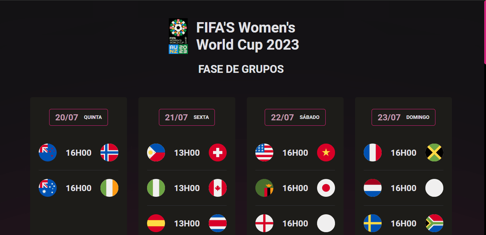

# NLW COPA ⚽

Projeto desenvolvido junto a Rocketseat durante a última NLW do ano, a NLW Copa, na Trilha Explorer.

O objetivo era criar um calendário para a Copa do Mundo, usando a tríade do Desenvolvimento Front-End e explorar diversos conceitos.

## Tecnologias Usadas 

- HTML5
- CSS3
- CSS Flexbox
- CSS Grid
- Javascript
- Git e GitHub

## Para acessar o Projeto
Para acessar o Calendário, basta <a href="#">clicar aqui</a>!

## Para mais informações sobre a FIFA Women's World Cup 2023

Para maiores informações sobre a Copa do Mundo Feminina, é só <a href="https://www.fifa.com/fifaplus/en/tournaments/womens/womensworldcup/australia-new-zealand2023">clicar aqui</a>!

## Demo

### Versão Desktop

    

### Versão Mobile

    

